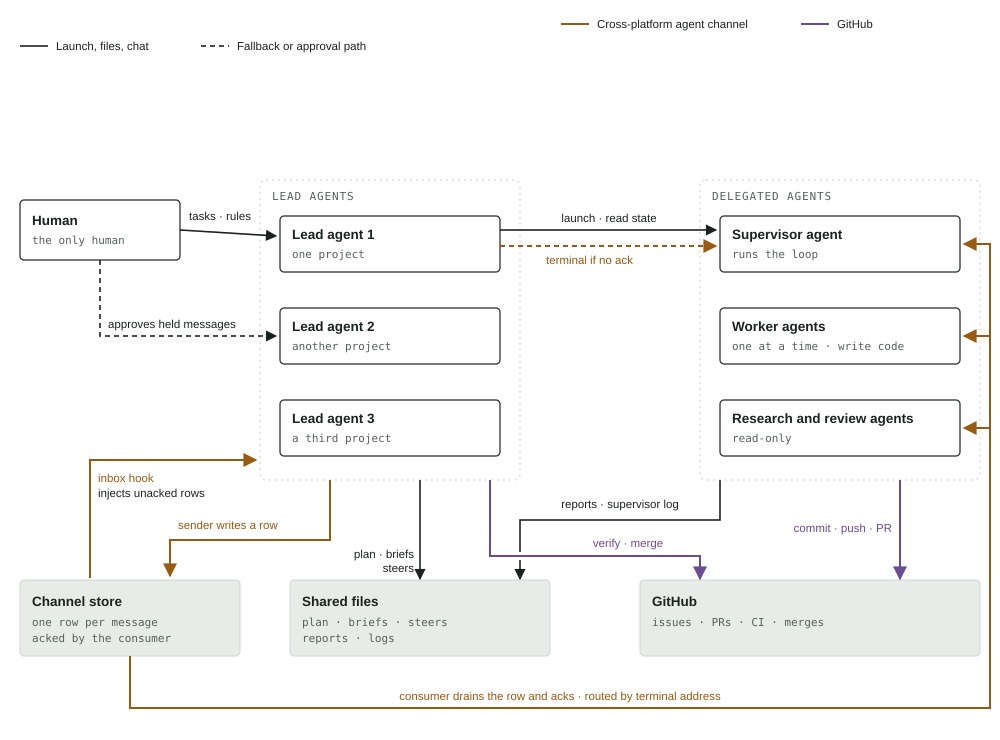

# Agent Switchboard

<picture><source media="(prefers-color-scheme: dark)" srcset="assets/switchboard-map-dark.svg"></picture>

## What this is

A file-backed mailbox with acks between agents on two runtimes on one machine. When the recipient has no mailbox consumer, the sender falls back to typing into the recipient's terminal and proving the text landed. A tab launcher opens delegated agents with their briefs and confirms they started.

## The four channels

- Closed channel, Runtime A: built-in agent-to-agent messages, reaching Runtime A agents only.
- Closed shared-session channel, Runtime B: one agent's session, joined by link from Runtime B or a browser.
- Cross-platform agent channel: this repo — a store on disk plus the terminal fallback; the only channel that reaches Runtime B agents directly.
- The shared record: issues, pull requests, checks and merges; messages point at it and do not replace it.

## What each line is built on

| Line | Built on | Where |
|---|---|---|
| Closed channel, Runtime A | Built into Runtime A: its own peer messaging and list of live peers. Nothing in this repo implements it. | built into Runtime A |
| Closed shared-session channel, Runtime B | Built into Runtime B: a shared session hosted from the terminal and joined by link, over the vendor's relay. | built into Runtime B, off this machine |
| Cross-platform channel: the store | One JSON line per message, in files on disk. The sender resolves the recipient's window and waits for the ack row. | `bin/agent-send.mjs`, `lib/agent-mailbox.mjs`, `$AGENT_SWITCHBOARD_DIR/mailbox/*.jsonl` |
| Cross-platform channel: the consumers | A hook inside each runtime reads unacked rows and acks them: at turn start or while parked in Runtime B, at each prompt in Runtime A. | `hooks/omp/pre/mailbox.ts`, `hooks/claude/mailbox-inject.mjs` |
| Terminal if no ack | Terminal remote control: types the message into the window. Delivery is proven by a new inbound row in that tab's session file. | `bin/kitty-send.sh` |
| Launch | Terminal remote control: opens a titled tab running the agent with its brief, confirms it started on screen, and refuses to close a window it did not launch. | `bin/omp-tab.sh` |
| Read state | Not the screen but the disk: the window's process, its terminal, and the runtime's terminal-sessions file whose last row is the state. | `bin/omp-tab-state.sh`, `bin/omp-idle-audit.mjs` |
| Files | Plain files in the round directory: plan, briefs, steers, reports, logs. | the round directory in project memory |
| Shared record | The `gh` command line: issues, pull requests, checks, merges. | `gh` |
| Approval path | Runtime A's own hold screen for a message between agents in different permission modes. | `settings.json` |

## Install

The hooks below plug into the Claude Code and omp runtimes, and the sender, fallback and launcher drive kitty; all three must be present for the full channel, while mailbox-only mode works anywhere node runs.

```sh
git clone <repo-url> ~/agent-switchboard
export PATH="$HOME/agent-switchboard/bin:$PATH"
```

`<checkout>` below is where you cloned it. Keep that checkout in place: the hooks import their siblings by relative path, so a hook file copied out on its own breaks.

### Runtime A (Claude Code): the inbox hook

Add the repo's hook file, in place, to the existing `UserPromptSubmit` hook list in `settings.json`:

```json
{
  "hooks": {
    "UserPromptSubmit": [
      {
        "hooks": [
          { "type": "command", "command": "node <checkout>/hooks/claude/mailbox-inject.mjs" }
        ]
      }
    ]
  }
}
```

The hook reads this session's unacked rows by session id, acks each with `prompt`, prints them as turn context, and refreshes this session's presence entry so senders route here instead of the terminal. It always exits 0 and prints nothing when the inbox is empty.

### Runtime B (omp): the consumer hook

omp loads hooks from its hooks directory. Symlink the repo's two hook files into it so the relative imports (`../lib/window-id.ts`, `../../../lib/agent-mailbox.mjs`) keep resolving to the checkout:

```sh
mkdir -p ~/.omp/agent/hooks/pre ~/.omp/agent/hooks/lib
ln -s <checkout>/hooks/omp/pre/mailbox.ts ~/.omp/agent/hooks/pre/switchboard-mailbox.ts
ln -s <checkout>/hooks/omp/lib/window-id.ts ~/.omp/agent/hooks/lib/switchboard-window-id.ts
```

The hook drains unacked rows at turn start and at tool-execution end, acks each first with `steer` (`now`, `stop`) or `followUp` (`idle`, `queue`), and watches the mailbox directory while parked so it can wake an idle session. It releases presence at shutdown so later sends fall back to the terminal instead of a ghost consumer.

One runtime caveat: node >= 24 loads the `.ts` hook directly (that is what `npm test` runs under), but whether the omp runtime accepts the `.ts` import specifier is unverified — if it insists on a compiled extension, add a build step emitting `window-id.js` next to the source instead of renaming the import.

### Sending and launching

```sh
# Steer another agent; exit 0 means its consumer acked, exit 3 means queued, do not resend.
agent-send.mjs --to <window-id|title-substring|mailbox-key> --text "one line" [--now | --stop | --idle-when REGEX | --queue] [--deadline N]
agent-send.mjs --read                       # print and ack this session's inbox rows
agent-send.mjs --cancel --to <key> --id <r> # withdraw one queued row

# Open a titled tab with its brief and confirm it started (exit 2 means no terminal remote control).
omp-tab.sh --title "omp: <what this review is>" --brief /abs/brief.md [--out /abs/out.md] [--cwd /abs/repo]
           [--profile NAME | --no-profile] [--model PROVIDER/NAME] [--fallback]
           [--tools a,b,c] [--thinking low|medium|high] [--mcp full]
omp-tab.sh --list
omp-tab.sh --close <window-id>

# What a tab is doing, read from disk, never the screen.
omp-tab-state.sh <window-id> [--json] [--watch [--interval=S]]
```

`--now` (the default) and `--stop` interrupt; `--idle-when` and `--queue` wait for a parked proof. After an unacked wait the sender withdraws the mailbox row and falls through to `bin/kitty-send.sh`, which types the text plus carriage return in one call and proves it by a new inbound row in the tab's session file. A launch checks its provider can serve before opening the tab (see `config/omp-providers.json` below) and needs a key command when a provider bills by key:

```sh
export OMP_TAB_KEY_COMMAND='...'   # stdout emits the export line the tab evals before exec
```

## Configuration

Every variable, its default, and what reads it — taken from the code, not from memory.

| Variable | Default | Used by |
|---|---|---|
| `AGENT_SWITCHBOARD_DIR` | `${XDG_STATE_HOME:-$HOME/.local/state}/agent-switchboard` | `lib/presence.mjs`: root for presence and mailbox |
| `AGENT_SWITCHBOARD_PRESENCE_FILE` | `$AGENT_SWITCHBOARD_DIR/presence.json` | `lib/presence.mjs`: the live-beacon file |
| `AGENT_SWITCHBOARD_MAILBOX_DIR` | `$AGENT_SWITCHBOARD_DIR/mailbox` | `lib/agent-mailbox.mjs`: one JSONL file per recipient (`AGENT_MAILBOX_DIR` still honoured as the older name) |
| `AGENT_SWITCHBOARD_SENDER` | `another agent session` | `bin/agent-send.mjs`, `bin/kitty-send.sh`: the sender label on terminal-delivered notes |
| `AGENT_SWITCHBOARD_SEND` | `bin/kitty-send.sh` beside `agent-send.mjs` | `bin/agent-send.mjs`: the fallback sender (`AGENT_SEND_KITTY_SEND` wins when set) |
| `OMP_TAB_KEY_COMMAND` / `KEY_COMMAND` | unset (no key step; the tab runs `exec omp` directly) | `bin/omp-tab.sh`: when set, the tab evals its output before exec, and balance checks use it |
| `OMP_TAB_PROVIDERS` | `<checkout>/config/omp-providers.json` | `bin/omp-tab.sh`: provider table for the preflight and fallback walk |
| `OMP_TAB_PROBE_TIMEOUT` | `60` (seconds) | `bin/omp-tab.sh`: per-provider serve probe |
| `OMP_TAB_CONFIG` | `$HOME/.omp/agent/config.yml` | `bin/omp-tab.sh`: account default model when `--model` is absent |
| `OMP_TAB_STATE_DIR` | `$HOME/.omp/agent/terminal-sessions` | `bin/omp-tab-state.sh`: window-to-session links (omp's own directory — omp writes them, not this repo) |
| `OMP_TAB_STATE_SESSIONS_DIR` | `$HOME/.omp/agent/sessions` | `bin/omp-tab-state.sh`: canonical sessions dir the link arbitration prefers |
| `CLAUDE_CODE_SESSION_ID` | null (address by cwd only) | `hooks/claude/mailbox-inject.mjs`, `bin/agent-send.mjs`: Runtime A session identity |
| `OMP_SESSION_ID` | null (current key only) | `hooks/omp/pre/mailbox.ts`: Runtime B session identity, drains every key of the session |
| `KITTY_WINDOW_ID` | null (cwd join only) | both hooks, `lib/agent-mailbox.mjs`: exact window-to-session routing |

Two warnings, both load-bearing. `config/omp-providers.json` holds EXAMPLE providers with real public endpoints: a launch with that table unchanged bills those example accounts, so replace its rows with your own before launching anything real. `bin/omp-tab-state.sh` reads omp's own `$HOME/.omp/agent/terminal-sessions` and `sessions` whatever `AGENT_SWITCHBOARD_DIR` says — only the mailbox and presence live under the switchboard directory, because only this repo writes them.

Timers, for orientation: presence beacons go stale after 20 minutes (`PRESENCE_STALE_MS`, imported by the mailbox prune, never restated); the sender waits 20 s for an ack by default (`--deadline N`, unbounded for `--queue`); the parked-tab fallback poll ticks every 5 s (`IDLE_POLL_MS`); the queued terminal waiter heartbeats every 5 min and never times out unless `--deadline` caps it.

## Limits, plainly

- Same machine only. The store is files on disk and the fallback types into a local window; nothing here crosses a network boundary except Runtime B's own closed channel, which runs through the vendor's relay.
- Kitty remote control must be on for the fallback and the launcher. Without it the launcher exits 2, which tells the caller to fall back to headless and say so, and the sender leaves the row queued with exit 3.
- Mailbox-only mode works anywhere node runs: set `AGENT_SWITCHBOARD_DIR`, wire one hook, and `agent-send.mjs --queue` never needs a terminal.
- A message between Runtime A agents in different permission modes waits for the human's approval, and that hold is visible only to the human. Silence is not delivery: a held message is invisible to the receiving agent.
- Anything injected into a joined session leaves the machine — a guest sees the host's whole history, including what the machine injected into it. Never share a session link beyond the people who may read that history.

## Patterns

[`docs/patterns.md`](docs/patterns.md) recasts the eight observed and proposed exchanges as prose plus step lists: steering down a chain, delivery that never drops, a lease on one scarce slot, two leads editing one shared document, escalation from a held message to a policy, research with evidence-checked review, correction propagation to every copy, and a reply that finds its asker across runtimes. Each step says how its delivery is proven.
